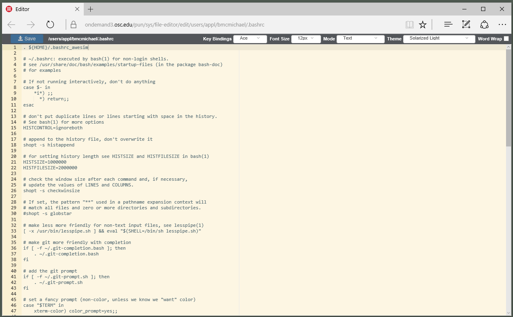

# OOD File Editor

[](https://badge.fury.io/gh/osc%2Food-fileeditor)
[](http://inch-ci.org/github/OSC/ood-fileeditor)

A simple Rails web app that uses https://ace.c9.io/ for editing files. It is meant to be used in conjunction with other Open OnDemand apps, so it provides a URL pattern for opening a file to edit that is exposed via https://github.com/osc/ood_appkit#file-editor-app. Thus, other Open OnDemand apps can easily provide an "open file for editing" link.

* [New Install](#new-install)
* [Updating to a new stable version](#updating-to-a-new-stable-version)
* [Usage](#usage)



## New Install

1. Start in the **build directory** for all sys apps, clone and check out the
   latest version of the editor app (make sure the app directory's name is
   `file-editor`):

   ```sh
   scl enable rh-git29 -- git clone https://github.com/OSC/ood-fileeditor.git file-editor
   cd file-editor
   scl enable rh-git29 -- git checkout tags/v1.3.3
   ```

2. Install the app for a production environment:

   ```sh
   RAILS_ENV=production scl enable rh-git29 rh-ruby24 rh-nodejs6 -- bin/setup
   ```

3. Copy the built app directory to the deployment directory, and start the
   server. i.e.:

   ```sh
   sudo mkdir -p /var/www/ood/apps/sys
   sudo cp -r . /var/www/ood/apps/sys/file-editor
   ```

## Updating to a New Stable Version

1. Navigate to the app's build directory and check out the latest version:

   ```sh
   cd file-editor # cd to build directory
   scl enable rh-git29 -- git fetch
   scl enable rh-git29 -- git checkout tags/v1.3.3
   ```

2. Update the app for a production environment:

   ```sh
   RAILS_ENV=production scl enable rh-git29 rh-ruby24 rh-nodejs6 -- bin/setup
   ```

3. Copy the built app directory to the deployment directory:

   ```sh
   sudo rsync -rlptv --delete . /var/www/ood/apps/sys/file-editor
   ```

## Usage

### File access

* Access files via `APP_PATH` + `/edit` + `FILE_PATH`
    * Example `https://ondemand3.osc.edu/pun/sys/file-editor/edit/nfs/08/bmcmichael/Files/tire.k`

### Directory access

The app provides a rudimentary file explorer in the case that a folder is accessed instead of a directory. If the path is readable to the user, it will be displayed when accessed.

* Access readable folder contents via `APP_PATH` + `/edit` + `FOLDER_PATH`
    * Example `https://ondemand3.osc.edu/pun/sys/file-editor/edit/nfs/08/bmcmichael/Files/`

## Contributing

Bug reports and pull requests are welcome on GitHub at
https://github.com/OSC/ood-fileeditor.

## License

The gem is available as open source under the terms of the [MIT
License](http://opensource.org/licenses/MIT).
