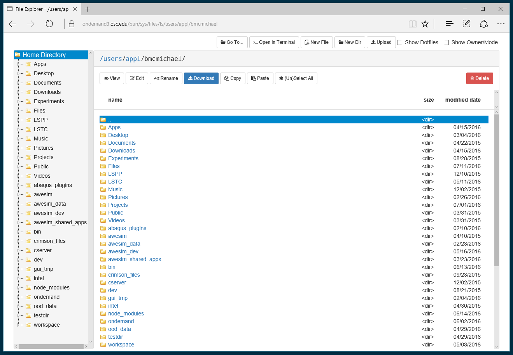

# OOD Files App

[](https://badge.fury.io/gh/OSC%2Food-fileexplorer)

A Node.js web based file explorer that is a modification of [CloudCommander](http://cloudcmd.io/) with a focus on a user friendly interface for file uploads, downloads, editing, renaming and copying. It is an Open OnDemand app that is meant to be run as the user.

* [New Install](#new-install)
* [Updating to a new stable version](#updating-to-a-new-stable-version)
* [Usage](#usage)
    * [API](#api)

## Features

* Create Files/Folders
* View Files
* Edit Files (with [OOD File Editor](https://github.com/OSC/ood-fileeditor) configured)
* Rename/Copy/Paste/Delete Files
* Upload large files
* Download files
* Launch Terminal in location (with [OOD Shell](https://github.com/OSC/ood-shell) configured)



## New Install

1. Start in the **build directory** for all sys apps, clone and check out the
   latest version of the files app (make sure the app directory's name is
   `files`):

   ```sh
   scl enable rh-git29 -- git clone https://github.com/OSC/ood-fileexplorer.git files
   cd files
   scl enable rh-git29 -- git checkout tags/v1.4.1
   ```

2. Install the app:

   ```sh
     scl enable rh-git29 rh-ruby24 rh-nodejs6 -- bin/setup
   ```

3. Copy the built app directory to the deployment directory, and start the
   server. i.e.:

   ```sh
   sudo mkdir -p /var/www/ood/apps/sys
   sudo cp -r . /var/www/ood/apps/sys/files
   ```

## Updating to a New Stable Version

1. Navigate to the app's build directory and check out the latest version:

   ```sh
   cd files # cd to build directory
   scl enable rh-git29 -- git fetch
   scl enable rh-git29 -- git checkout tags/v1.4.1
   ```

2. Update the app:

   ```sh
   scl enable rh-git29 rh-ruby24 rh-nodejs6 -- bin/setup
   ```

3. Copy the built app directory to the deployment directory:

   ```sh
   sudo rsync -rlptv --delete . /var/www/ood/apps/sys/files
   ```

## Configuration

(OPTIONAL) Update the application settings via environment variables as appropriate.

  * Copy the `.env.example` to `/etc/ood/config/apps/files/env`

    ```sh
    sudo cp .env.example /etc/ood/config/apps/files/env
    ```

  * Uncomment the variables you wish to modify

    ```sh
    # The uri path to the ood-fileeditor app (if installed) [Default: "/pun/sys/file-editor/edit"]
    # Uncomment the line below to configure the file editor URI path.
    # OOD_FILE_EDITOR='/pun/sys/file-editor/edit'

    # The uri path to the ood-shell app (if installed) [Default: "/pun/sys/shell/ssh/default"]
    # Uncomment the line below to configure shell URI path.
    # OOD_SHELL='/pun/sys/shell/ssh/default'

    # The maximum file upload size as integer (in bytes) [Default: 10485760000]
    # Uncomment the line below to configure the maximum upload size.
    # FILE_UPLOAD_MAX=10485760000
    ```

    * Uncomment and update `OOD_FILE_EDITOR` to the path of the system installed [`ood-fileeditor`](https://github.com/OSC/ood-fileeditor) application. Setting this value to an empty string will remove the "Edit Files" button and option from the file explorer. (ex. `OOD_FILE_EDITOR=''`)

    * Uncomment and update `OOD_SHELL` to the path of the system installed [`ood-shell`](https://github.com/OSC/ood-shell) application. Setting this value to an empty string will remove the "Open in Terminal" button and option from the file explorer. (ex. `OOD_SHELL=''`)

    * Uncomment and update `FILE_UPLOAD_MAX` to be the maximum allowable upload size (in bytes) for file uploads in the app. If a user attempts to exceed this value, the upload will be blocked. Uploads are buffered in an NGINX temporary directory (by default `/var/lib/nginx/tmp/$USER/client_body` by the Passenger process, so uploads will be practically limited by the available space in this location. The temporary directory can be changed by changing the setting [`pun_tmp_root` in the `nginx_stage.yml`](https://github.com/OSC/ondemand/blob/d5514a7bb8f9c76cb876f4067244b30ac7bef615/nginx_stage/share/nginx_stage_example.yml#L96). It is recommended that this value be less than half of the available space in `/var/tmp`, or less, to allow for concurrent uploaders. If this value is not configured, the default will be 10 GB.

## Usage

For general usage instructions see: https://www.osc.edu/supercomputing/ondemand/file-transfer-and-management

### API

The Files App contains a node-js REST API based on the [`node-restafary`](https://github.com/coderaiser/node-restafary) package, which can be used by other applications in the OnDemand Environment.

|URL                            |HTTP Verb   |Body               |Description                    |
|:------------------------------|:-----------|:------------------|:------------------------------|
|`/api/v1/fs/<path>`            |`GET`       |                   | get file or dir content       |
|`/api/v1/fs/<path>?size`       |`GET`       |                   | get file or dir size          |
|`/api/v1/fs/<path>?time`       |`GET`       |                   | get time of file or dir change|
|`/api/v1/fs/<path>?hash`       |`GET`       |                   | get file hash (SHA-1)         |
|`/api/v1/fs/<path>?beautify`   |`GET`       |                   | beautify js, html, css        |
|`/api/v1/fs/<path>?minify`     |`GET`       |                   | minify js, html, css          |
|`/api/v1/fs/<path>`            |`PUT`       | file content      | create/write file             |
|`/api/v1/fs/<path>?unzip`      |`PUT`       | file content      | unzip and create/write file   |
|`/api/v1/fs/<path>?dir`        |`PUT`       |                   | create dir                    |
|`/api/v1/fs/<path>`            |`PATCH`     | diff              | patch file                    |
|`/api/v1/fs/<path>`            |`DELETE`    |                   | delete file                   |
|`/api/v1/fs/<path>?files`      |`DELETE`    | array of names    | delete files                  |

#### Example:

GET requests will follow the pattern `App Root` + `api/v1/fs/` + `File Path`, where File Path will be the absolute path of a file on the system.

* To GET a file named `/users/appl/bmcmichael/.gitconfig` at the OSC deployment of OnDemand, the link would be:
  * `https://ondemand3.osc.edu/pun/sys/files/api/v1/fs/users/appl/bmcmichael/.gitconfig`
    * App Root: `https://ondemand3.osc.edu/pun/sys/files/`
    * API Route: `api/v1/fs/`
    * File Path: `/users/appl/bmcmichael/.gitconfig`

Since the application is running as the logged in user, the application will only have access to the files that the user actually has access to within the file system.

## Development

For development purposes the environment variables must be specified in the
local environment file:

```
.env.local
```

underneath the root directory of this app in your sandbox.

To mimic the production environment you may have to copy the production
environment variables down or set up a symbolic link:

```sh
# Copy production env vars
cp /etc/ood/config/apps/files/env .env.local

# or setup a symlink
ln -s /etc/ood/config/apps/files/env .env.local
```

Any changes made to the environment files require an app restart in order for
the changes to take effect:

```console
$ touch tmp/restart.txt
```

### Updating the `cloudcmd` dependency

`ood-fileexplorer` currently uses a modified fork of [CloudCmd](http://cloudcmd.io/), the latest OOD version of which is at [OSC/cloudcmd](https://github.com/OSC/cloudcmd/releases). This version has been heavily modified from the original and is maintained as a separate fork.  

- To update to a new version of cloudcmd, make the changes and tag a new release at the OSC/cloudcmd repository
- Update the `package.json` file in the OSC/ood-fileexplorer repository to include the new tag
```text
"dependencies": {
    ...
    "cloudcmd": "git://github.com/OSC/cloudcmd.git#v5.3.1-osc.29",
    ...
  },
```
- Back up and delete the `npm-shrinkwrap.json` file

- Remove the `node_modules` directory ex. `rm -rf node_modules/`

- Install the new modules: `npm i`

- Perform a new shrinkwrap operation: `npm shrinkwrap`

- Find and copy the following lines pertaining to the `cloudcmd` dependency in the new `npm-shrinkwrap.json`

```text
"cloudcmd": {
      "version": "5.3.1",
      "from": "git://github.com/OSC/cloudcmd.git#v5.3.1-osc.29",
      "resolved": "git://github.com/OSC/cloudcmd.git#b19f86a972e4c127bdec3a4a50c939eb7d7b645b",
```

- Paste the lines copied from the new shrinkwrap file over the top of the matching lines in the backed up `npm-shrinkwrap.json` file. Delete the new `npm-shrinkwrap` and replace it with the backed up copy that includes the pasted lines.

- Remove the `node_modules` folder: `rm -rf node_modules/`

- Install shrinkwrapped dependencies: `npm i`

## Contributing

Bug reports and pull requests are welcome on GitHub at
https://github.com/OSC/ood-fileexplorer.

## License

The gem is available as open source under the terms of the [MIT
License](http://opensource.org/licenses/MIT).
